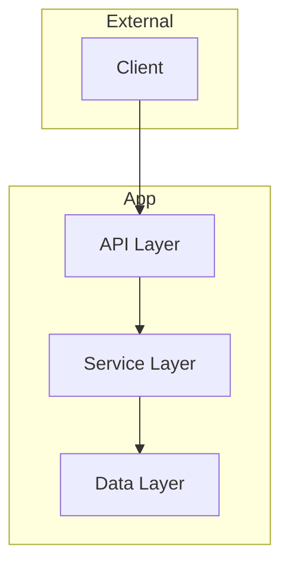

# Document Templates

## Contents

- [CLAUDE.md (base)](#claudemd-500-tokens)
- [CLAUDE.md — Monorepo](#claudemd-monorepo-variant)
- [CLAUDE.md — Library](#claudemd-library-variant)
- [CLAUDE.md — Microservices](#claudemd-microservices-variant)
- [architecture.md](#architecturemd)
- [conventions.md](#conventionsmd)
- [glossary.md](#glossarymd)
- [Indexing Output Format](#indexing-output-format-for-conversation-history)

---

## CLAUDE.md (<500 tokens)

````markdown
# {repo-name}
{One sentence: purpose, users, core value}

## Stack
{lang} {version}, {framework}, {db}, {key-dep-1}, {key-dep-2}

## Commands
```bash
# Install
{install_cmd}

# Run
{run_cmd}

# Test
{test_cmd}

# Build
{build_cmd}
```

## Context Loading
1. Claude memory has repo overview
2. Search past chats: "{repo-name} architecture"
3. If needed: `cat .claude/memory/{file}.md`

<!-- USER: Add notes below -->
````

---

## CLAUDE.md — Monorepo variant

````markdown
# {repo-name}
{One sentence: purpose, users, core value}

## Stack
{lang} {version}, {framework}, {key-dep-1}, {key-dep-2}

## Packages
- `packages/{name}` - {description}
- `apps/{name}` - {description}

## Commands
```bash
# Install all packages
{install_cmd}

# Run workspace command
{workspace_cmd} {package} {command}

# Test all
{test_cmd}

# Build
{build_cmd}
```

## Context Loading
1. Claude memory has repo overview
2. Search past chats: "{repo-name} architecture"
3. If needed: `cat .claude/memory/{file}.md`

<!-- USER: Add notes below -->
````

---

## CLAUDE.md — Library variant

````markdown
# {repo-name}
{One sentence: what the library does, target users}

## Stack
{lang} {version}, {framework}, {key-dep-1}

## Public API
- `{module}.{function}()` - {description}
- `{module}.{Class}` - {description}

## Commands
```bash
# Install
{install_cmd}

# Test
{test_cmd}

# Build / publish
{build_cmd}
{publish_cmd}
```

## Context Loading
1. Claude memory has repo overview
2. Search past chats: "{repo-name} architecture"
3. If needed: `cat .claude/memory/{file}.md`

<!-- USER: Add notes below -->
````

---

## CLAUDE.md — Microservices variant

````markdown
# {repo-name}
{One sentence: system purpose and users}

## Stack
{lang} {version}, {framework}, {db}, {message-broker}

## Services
| Service | Purpose | Port |
|---------|---------|------|
| `{service-name}` | {description} | {port} |

## Commands
```bash
# Start all services
docker compose up

# Start single service
docker compose up {service}

# Test
{test_cmd}

# Build
{build_cmd}
```

## Context Loading
1. Claude memory has repo overview
2. Search past chats: "{repo-name} architecture"
3. If needed: `cat .claude/memory/{file}.md`

<!-- USER: Add notes below -->
````

---

## architecture.md

````markdown
# Architecture

## Overview
{2-3 sentences: architectural style, key decisions}

## Diagram


## Boundaries

| Component | Owns | Depends On |
|-----------|------|------------|
| {component} | {data} | {deps} |

## Key Flows
1. {flow-name}: {step} → {step} → {step}

<!-- USER -->
````

---

## conventions.md

```markdown
# Conventions

## Naming
| Element | Pattern | Example |
|---------|---------|---------|
| Files | {pattern} | `{example}` |
| Functions | {pattern} | `{example}` |

## Patterns
- Error handling: {pattern}
- Logging: {pattern}
- Testing: {location}, {naming}

## Git
- Branches: `{pattern}`
- Commits: `{pattern}`

<!-- USER -->
```

---

## glossary.md

```markdown
# Glossary

## Domain Terms
| Term | Definition |
|------|------------|
| {term} | {definition} |

## Acronyms
| Acronym | Meaning |
|---------|---------|
| {acronym} | {meaning} |

<!-- USER -->
```

---

## Indexing Output Format (for conversation history)

```markdown
---
### REPO: {name}
### INDEXED: {YYYY-MM-DD}
### TYPE: {monorepo|microservices|single_app|library}

### SUMMARY
{2-3 sentence overview}

### TECH STACK
- Language: {lang} {version}
- Framework: {framework}
- Database: {db}
- Key deps: {deps}

### ARCHITECTURE
{Detailed analysis - this lives in conversation, not files}

### CONVENTIONS
{Detailed analysis}

### KEY INSIGHTS
- {insight-1}
- {insight-2}

### SEARCH KEYWORDS
{repo-name}, {tech-stack}, {patterns}, {domain-terms}
---
```

This format enables effective `conversation_search` retrieval.
